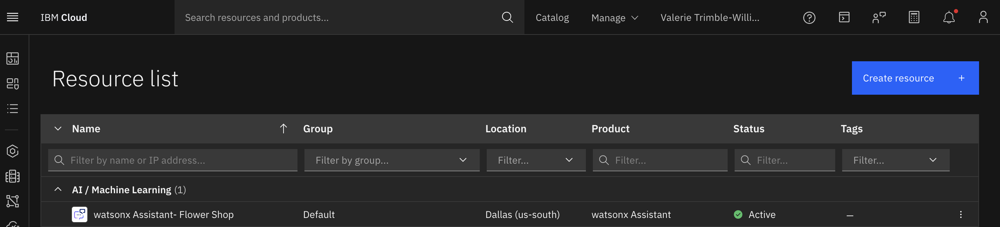
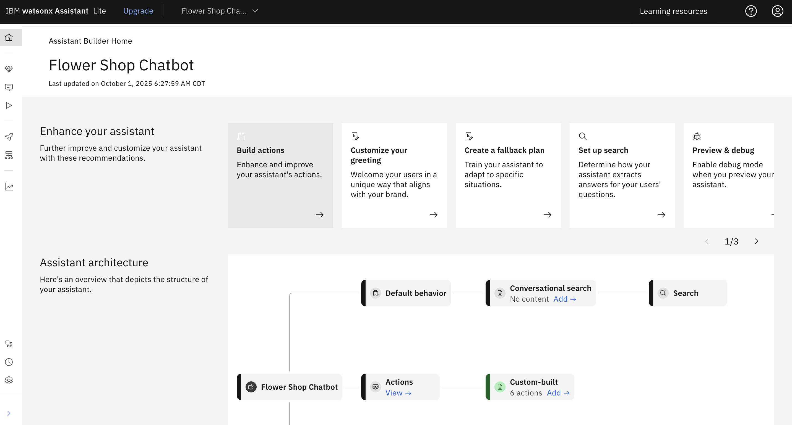
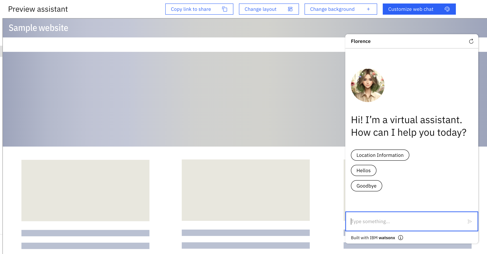

# Flower Shop Chatbot (IBM Watson)

## Live Chatbot
🔗 [Access the live chatbot here](https://web-chat.global.assistant.watson.appdomain.cloud/preview.html?backgroundImageURL=https%3A%2F%2Fus-south.assistant.watson.cloud.ibm.com%2Fpublic%2Fimages%2Fupx-5894523e-24cd-42ae-b012-f4934f7ad523%3A%3A05475ee2-28c6-40d6-a9c6-515290302034&integrationID=faa85d61-7523-488e-97fc-540c78dd5385&region=us-south&serviceInstanceID=5894523e-24cd-42ae-b012-f4934f7ad523)

## Demo Video
🎥 [Watch the chatbot in action](YOUR-DEMO-VIDEO-LINK)

## Overview
This project demonstrates the design, training, and deployment of a conversational AI chatbot for a Flower Shop using **IBM Watson Assistant**. The chatbot can handle customer inquiries, provide product information, and guide users through ordering workflows, showcasing applied NLP skills and hands-on cloud experience.

## Tools & Technologies
- IBM Watson Assistant  
- IBM Cloud  
- Intent & entity design  
- Conversation flow development  
- NLP (Natural Language Processing)

## What I Built
- Designed the chatbot conversation flows and user interactions  
- Created and trained intents and entities  
- Tested the chatbot with sample conversations  
- Deployed the chatbot on a live webpage  
- Managed IBM Cloud resources and environment setup

## Screenshots

### IBM Cloud Resource List
  
Shows all IBM Cloud resources used for the Watson Assistant chatbot, including services and instances.

### Watson Assistant Dashboard
  
Displays the chatbot design interface and conversation flows in Watson Assistant.

### Live Chatbot Webpage
  
Demonstrates the deployed chatbot interacting with users

